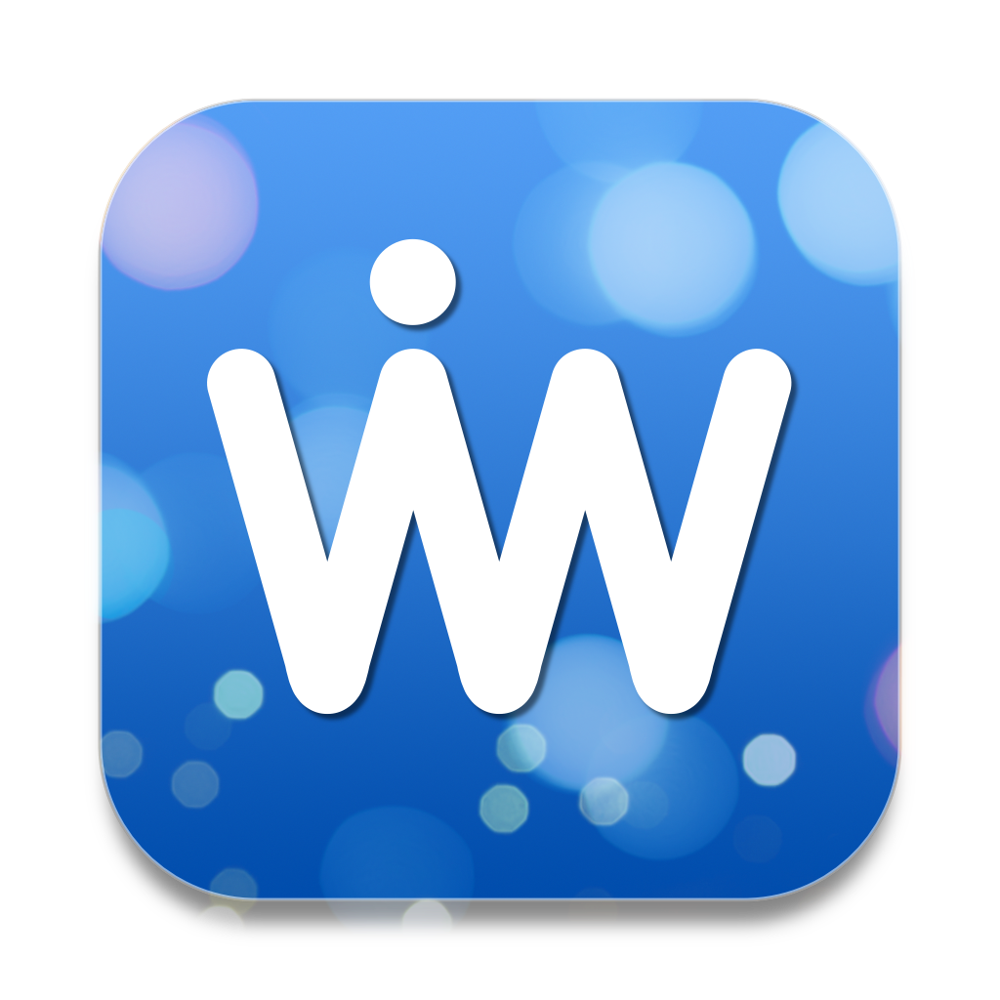

<div align="center">
<h1>VibeWave</h1>
一款 macOS 原生应用，让你洞察自己的 Vibe Coding 节奏。

> **注意**: 目前仅支持 OpenCode



[](https://opensource.org/licenses/MIT)
[](https://swift.org)
[](https://www.apple.com/macos)

[中文](README.zh_CN.md)  |  [English](README.md)

[功能特性](#功能特性) • [快速开始](#快速开始) • [贡献指南](#贡献指南)

</div>

---

## 功能特性

VibeWave 提供了一套完整的 OpenCode AI 使用统计和分析功能：

### 统计指标
- **用量统计**: Token 消耗、会话数量、总成本
- **模型分析**: Top 5 模型使用排名
- **项目分析**: Top 5 项目使用排名
- **时间趋势**: 按天/周/月查看使用趋势
- **效率指标**: Token 输出比、推理 Token 占比等

### 国际化
- **多语言支持**: 中文、英文
- **双语界面**: 完整的国际化支持

---

## 快速开始

### 系统要求
- macOS 14.0 或更高版本
- Xcode 15.0 或更高版本（开发）
- Swift 5.10 或更高版本

### 安装

```bash
# 克隆仓库
git clone https://github.com/lumenvibewave/vibewave.git
cd vibewave

# 构建项目
swift build

# 运行应用
swift run vibewave
```

### 配置

首次运行后，在 Settings 页面配置 OpenCode 数据源路径：

1. 打开 VibeWave 应用
2. 点击 Settings 标签
3. 选择同步策略（推荐：自动同步）

---

## 贡献指南

欢迎贡献代码、报告问题或提出新功能建议！

### 如何贡献
1. Fork 本仓库
2. 创建您的特性分支 (`git checkout -b feature/AmazingFeature`)
3. 提交您的更改 (`git commit -m 'Add some AmazingFeature'`)
4. 推送到分支 (`git push origin feature/AmazingFeature`)
5. 开启一个 Pull Request

---

## 开源协议

本项目采用 [MIT License](LICENSE) 开源。

---

<div align="center">
<b>用 ❤️ 构建</b>

**[回到顶部 ↑](#vibewave)**

</div>
